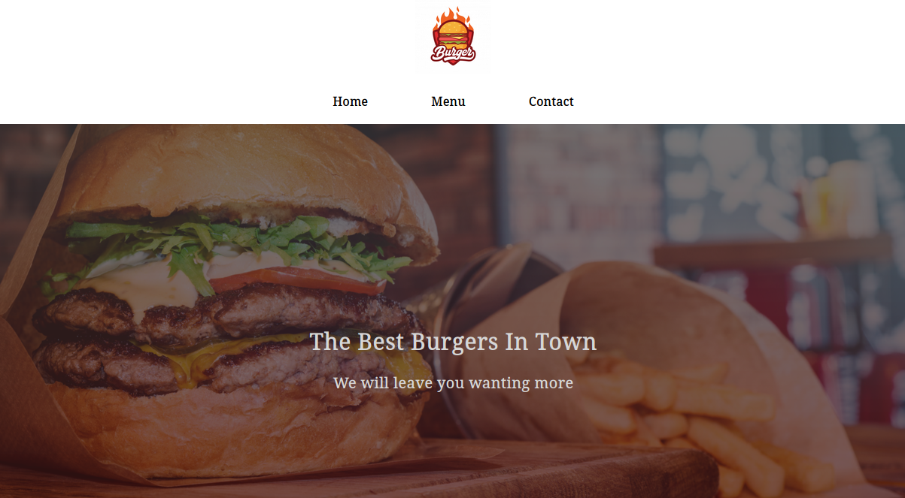
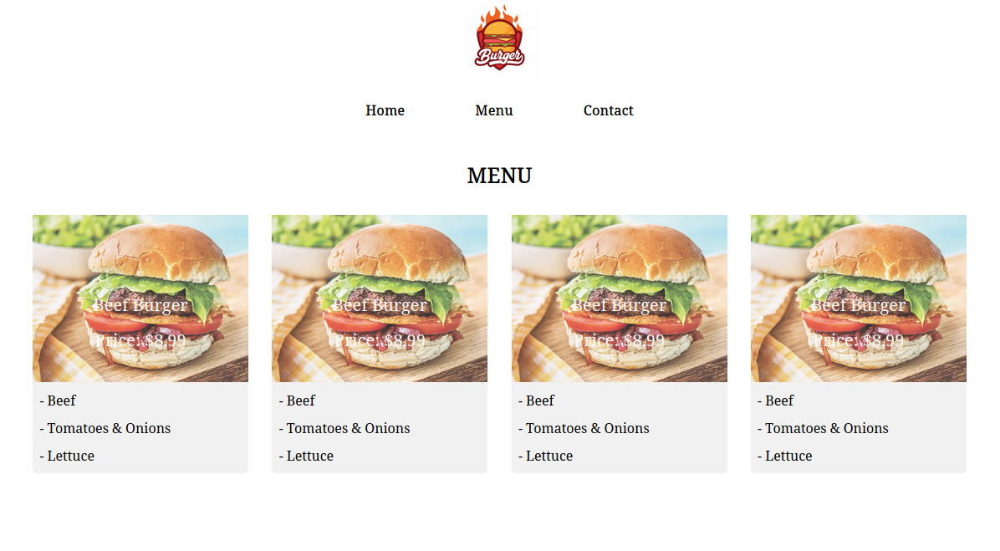
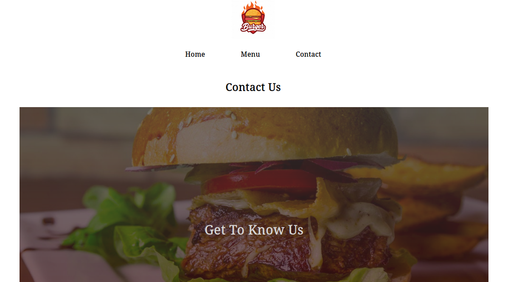

# RESTAURANT PAGE

This app is a Restaurant Webpage that has been rendered entirely in Javascript using DOM manipulation. Full Project Description [here](https://www.theodinproject.com/courses/javascript/lessons/restaurant-page)

## Screenshots







## Online Version
 [Live Demo ](https://kwizl.github.io/restaurant/)

## Content

* [Built With](#built-with)
* [Getting Start](#getting-start)
* [Contributing](#contributing)
* [Acknowledgments](#acknowledgments)
* [Authors](#authors)

## Built With

- HTML5
- CSS3
- Javascript
- ESLint (Linter), Stylint
- Git, Github and VScode
<br>

## Getting Start

#### Get a local copy
Now you need a copy of this application if you are using Git:
```js
git@github.com:kwizl/restaurant.git
```
Click (Download Zip) on the green button (Clone or Download) on this page.

#### Run App

- Open your command prompt or terminal and navigate inside the downloaded project
- Type in the terminal `npm install`
- Type in the terminal `npx webpack` or `npx webpack --watch`
- Open the `index.html` in the dist folder on your Browser.`


### Contributing

Contributions, issues, and feature requests are welcome!

You can do it on [issues page](issues/).

## Acknowledgments

A special thanks to all Microverse Team and Code Reviewers that guides me through my learning.

## Authors

👤 **Martin Njoroge**

- Github: [@kwizl](https://github.com/kwizl)
- Twitter: [@NjoroKaris](https://twitter.com/NjoroKaris)
- Linkedin: [Martin Njoroge](https://www.linkedin.com/in/martin-kariuki-njoroge/)
